# 千企AI

#### 介绍
千企AI是集大模型能力接入、使用、管理于一体的一站式AI应用开发平台， 集成业界主流的对话模型、嵌入模型以及多模态模型，为用户提供智能知识库、客服、聊天助手、智能体、工作流、以及文生图等AI能力。
平台致力于降低AI能力使用门槛，让更多的中小企业可以低成本甚至0成本落地AI能力，满足公司各种业务场景的需要。

#### 使用体验

网址：  http://ai.cnaider.cn/

管理端
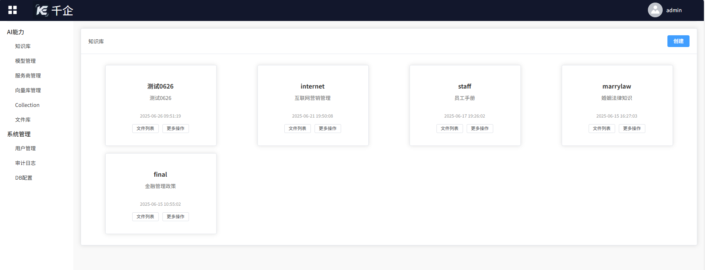

用户端
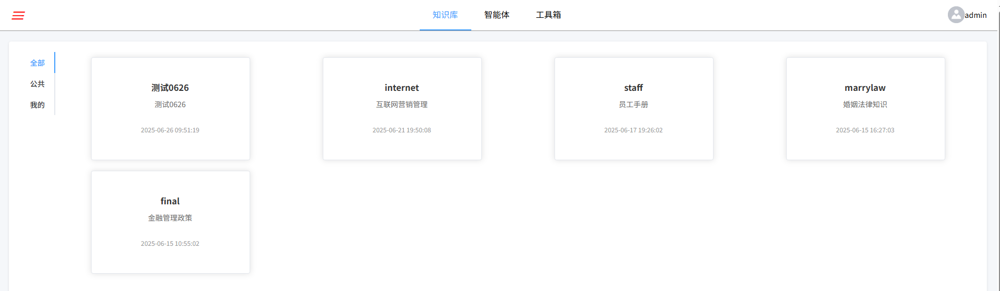

#### 平台特色

1、一站式服务
   网上传播的很多大模型应用工具或平台仅适用于个人用户，个别企业级平台也都是聚焦在模型服务、智能体方面的能力供给，多模态能力没有集成，而我们“千企”平台提供一站式服务，既有AI能力也有系统管理，不需要额外开发。
2、落地方式
   平台提供测试打包后的成品，不需要用户本地克隆代码，搭建开发环境、各种配置等繁琐操作， 用户按照操作文档很快就可以将安装包本地部署起来
3、架构设计
  业界很多主流平台为了部署和营销方便，功能都是一体化发布的。“千企”平台实现了用户端与管理端的门户分离，架构更合理，使用体验更好。

#### 安装教程

安装过程主要分以下几步：

1.  操作系统
2.  数据库
3.  JDK 17
4.  Nginx
5、 启动应用

版主会提供详细的安装操作手册，必要时也可以为用户现场或者远程部署，免费。

#### 使用说明

管理端

第1步：添加模型服务商 

第2步：添加模型	 

第3步：配置向量数据库
	 
第4步  创建知识库	
 
第5步，上传文件	 

用户端，直接使用	 

 **管理端** 

第1步：添加模型服务商
初始状态下，系统已经添加了主流的模型服务商信息，用户无限添加，只需要修改服务商信息，配置申请到的APIKey即可

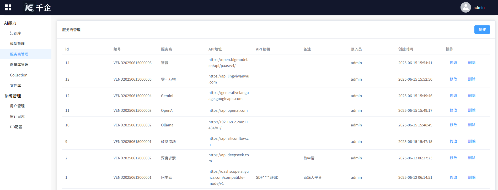

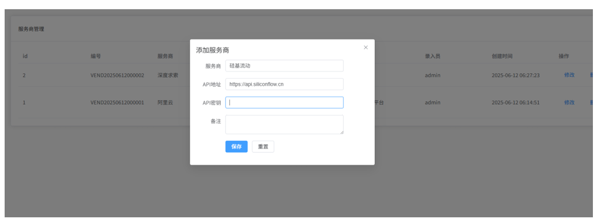
第2步：添加模型
初始状态下，系统已经默认添加了主流的模型，包括对话模型、嵌入模型、图像模型等，用户可以直接跳过
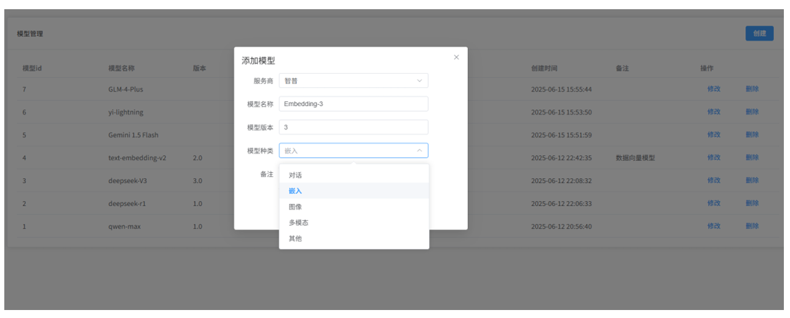
第3步：配置向量数据库
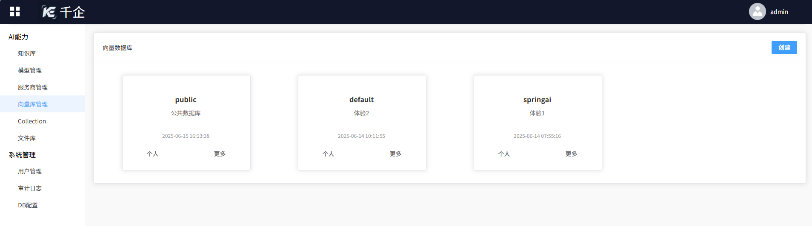
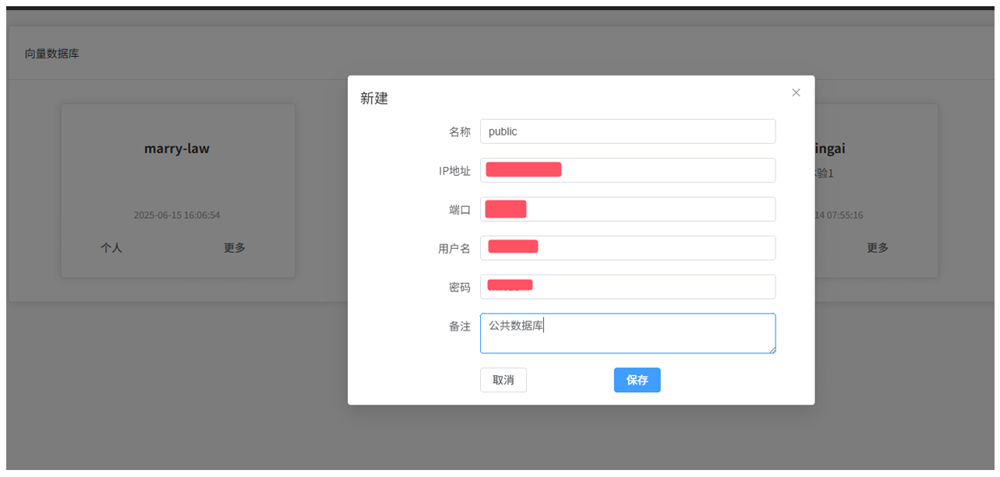
第4步  创建知识库
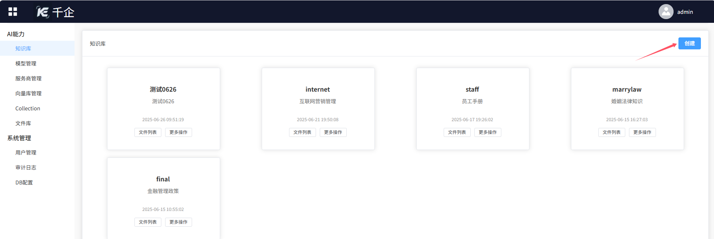
勾选嵌入模型、向量数据库，后台一键创建完成
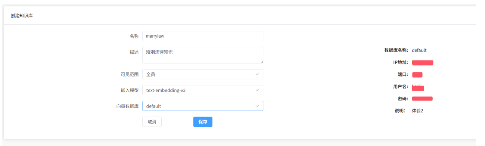
第5步，上传文件
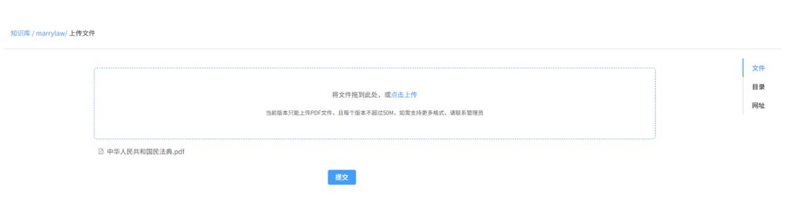

 **用户端** 

点击目标知识库
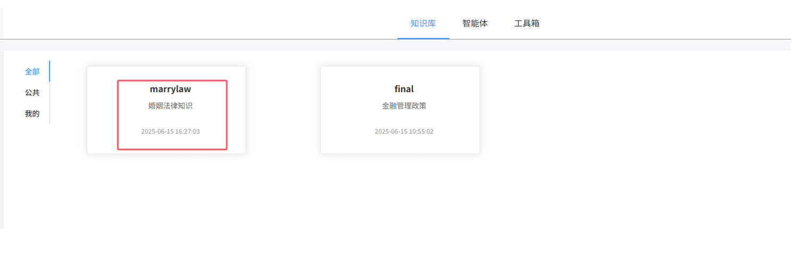
开始体验体验智能知识库
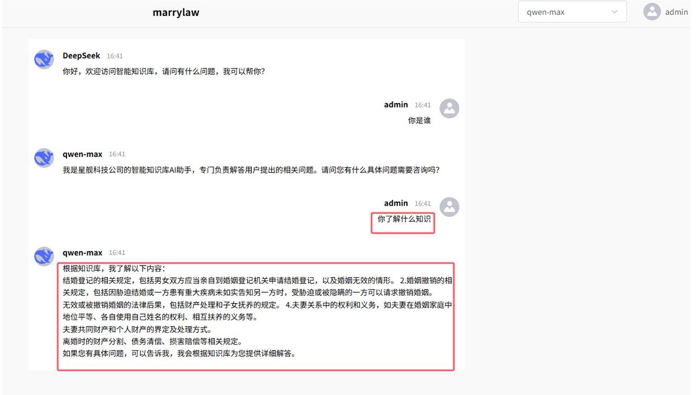

#### 联系我们

1、合作对象

有如下特点或诉求的中小微企业、事业单位与个人，都欢迎与我们联系

-  没有软件研发团队
-  有大量的历史数据、各种文档
-  对数据安全有要求
-  想借助AI为业务赋能，如智能客服、企业知识库
-  预算有限
-  对AI有兴趣，想体验AI，使用AI的能力

2、联系我们

  欢迎扫码咨询，只要你有需要，我们全力支持。
  
   
  

#### 参与贡献

1.  Fork 本仓库
2.  新建 Feat_xxx 分支
3.  提交代码
4.  新建 Pull Request

#### 特技

1.  使用 Readme\_XXX.md 来支持不同的语言，例如 Readme\_en.md, Readme\_zh.md
2.  Gitee 官方博客 [blog.gitee.com](https://blog.gitee.com)
3.  你可以 [https://gitee.com/explore](https://gitee.com/explore) 这个地址来了解 Gitee 上的优秀开源项目
4.  [GVP](https://gitee.com/gvp) 全称是 Gitee 最有价值开源项目，是综合评定出的优秀开源项目
5.  Gitee 官方提供的使用手册 [https://gitee.com/help](https://gitee.com/help)
6.  Gitee 封面人物是一档用来展示 Gitee 会员风采的栏目 [https://gitee.com/gitee-stars/](https://gitee.com/gitee-stars/)
