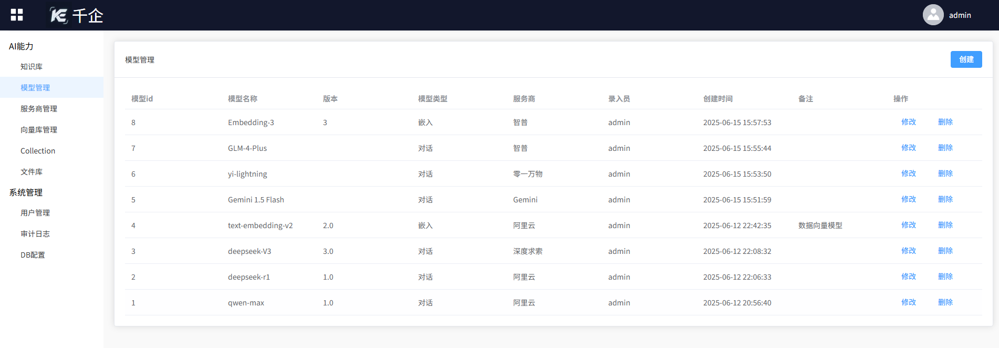
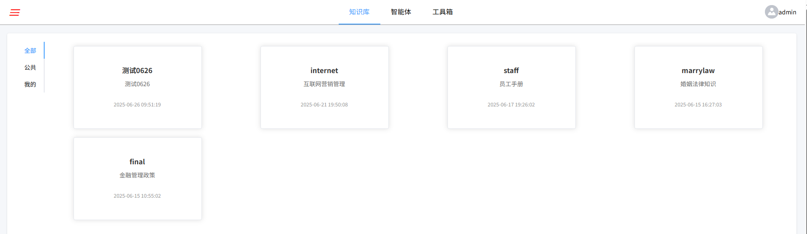

# 千企AI

#### 介绍
千企AI是集大模型能力接入、使用、管理于一体的一站式AI应用开发平台， 集成业界主流的对话模型、嵌入模型以及多模态模型，为用户提供智能知识库、客服、聊天助手、智能体、工作流、以及文生图等AI能力。
平台致力于降低AI能力使用门槛，让更多的中小企业可以低成本甚至0成本落地AI能力，满足公司各种业务场景的需要。

#### 体验试用

网址：  http://ai.cnaider.cn/

管理端

用户端

#### 平台特色

1、一站式服务

   网上传播的很多大模型应用工具或平台仅适用于个人用户，个别企业级平台也都是聚焦在模型服务、智能体方面的能力供给，多模态能力没有集成，而我们“千企”平台提供一站式服务，既有AI能力也有系统管理，不需要额外开发。

2、落地方式

   平台提供测试打包后的成品，不需要用户本地克隆代码，搭建开发环境、各种配置等繁琐操作， 用户按照操作文档很快就可以将安装包本地部署起来

3、架构设计

  业界很多主流平台为了部署和营销方便，功能都是一体化发布的。“千企”平台实现了用户端与管理端的门户分离，架构更合理，使用体验更好。

#### 安装教程

安装过程主要分以下几步：

1.  操作系统

2.  数据库

3.  JDK 17

4.  Nginx

5.  启动应用

版主会提供详细的安装操作手册，必要时也可以为用户现场或者远程部署，免费。

#### 使用说明

管理端

第1步：添加模型服务商 

第2步：添加模型	 

第3步：配置向量数据库
	 
第4步: 创建知识库	
 
第5步: 上传文件	 

用户端，直接使用	 

详见：https://gitee.com/aiqianqi/thousand-enterprises-ai/wikis/%E7%94%A8%E6%88%B7%E6%89%8B%E5%86%8C

#### 合作对象

有如下特点或诉求的中小微企业、事业单位与个人，都欢迎与我们联系

-  没有软件研发团队
-  有大量的历史数据、各种文档
-  对数据安全有要求
-  想借助AI为业务赋能，如智能客服、企业知识库
-  预算有限
-  对AI有兴趣，想体验AI，使用AI的能力

#### 联系我们

    欢迎加微信： qianqimodel  
   
    只要你有需要，我们全力支持。
 

#### 版权声明

1. 本软件分为基础版本与高级版本

   基础版本完全免费，遵守Apache-2.0 开源协议，但不允许删除、修改或隐藏千企平台的 LOGO、版权信息等内容。 使用即视为同意如上约定。
   在遵守 Apache-2.0 开源协议、以及相关法律法规的情况下，允许自由商业使用。

  高级版本以编译后的安装包形式提供，用户不得：

   - 逆向工程、反编译或修改软件；
   - 分发、转售或以任何形式牟利；

  违反者将承担法律责任。

2. 在未收取任何费用的情况下，用户自行对使用结果负责

3. 无论基础版本还是高级版本，我们都会全力提供技术支持。

 

